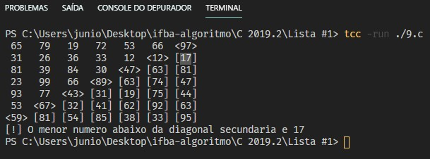

> _Discente:_ Jeovane Santos Viana

- [x] 5º) Escreva uma função que recebe um inteiro e imprima esse valor em algarismos romanos. Por exemplo, se essa função receber 18 deve imprimir XVIII.

  

- [x] 6º) Um dos sistemas de encriptação mais antigos é atribuído a Júlio César: se uma letra a ser encriptadaé a letra de número N do alfabeto, substitua-a com a letra (N + K), onde K é um número inteiro constante (César utilizava K = 3). Usualmente consideramos o espaço como deslocamento zero e todos os cálculos são realizados com módulo-27. Dessa forma, para K = 1 a mensagem Ataque ao amanhecer se torna bubrvfabpabnboifdfs.

  a) _Faça uma função que receba como parâmetrosuma mensagem e um valor de K e retorne a mensagem criptografada pelo código de César. Fraquezasdo algoritmo: apenas 26 chaves possíveis._

  b) _Faça umafunção que receba como parâmetrosuma mensagem e um valor de K e retorne a mensagem descriptografada pelo código de César. Fraquezasdo algoritmo: apenas 26 chaves possíveis._

  
 
- [x] 7º) Na teoria dos sistemas, define-se como elemento minimax de uma matriz o menor elemento de uma linha onde se encontra o maior elemento da matriz. Faça uma função que recebe, por parâmetro,uma matriz A(10,10) e retorna aa sua posiçãode seu elemento minimax.

  

- [x] 8º) Faça uma função que receba, por parâmetro, uma matriz A(12,12) e retorne a média aritmética dos elementos abaixo da diagonal principal.

  

- [x] 9º) Faça uma função que receba, por parâmetro, uma matriz A(7,7) e retorne o menor valor dos elementos abaixo da diagonal secundária.

  

- [x] 10º) Faça uma função que receba, por parâmetro, uma matriz A(10,10) e retorne a soma dos elementos acima da diagonal principal.

  

- [x] 11º) Faça uma função que receba, por parâmetro, uma matriz A(12,12) e retorna a média aritmética dos elementos abaixo da diagonal principal e da diagonal secundária.

  

- [x] 12º) Faça uma função que receba, por parâmetro, uma matriz A(8,8) e retorne o menor valor dos elementos acima da diagonal secundária.

  

- [x] 13º) Faça uma função que receba, por parâmetro, uma matriz A(12,12) e retorna o produto dos elementos acima da diagonal principal e da diagonal secundária.

  